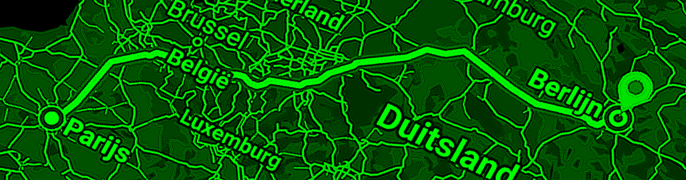

# from-paris-to-berlin-circuit-breaker

---

[](https://twitter.com/intent/tweet?text=Checkout%20this%20@bitbucket%20repo%20by%20@joaofse%20%F0%9F%91%A8%F0%9F%8F%BD%E2%80%8D%F0%9F%92%BB:%20https://github.com/jesperancinha/from-paris-to-berlin-circuit-breaker)
[](https://github.com/jesperancinha/from-paris-to-berlin-circuit-breaker)

[](https://circleci.com/gh/jesperancinha/from-paris-to-berlin-circuit-breaker)
[](https://github.com/jesperancinha/from-paris-to-berlin-circuit-breaker/actions/workflows/from-paris-to-berlin-circuit-breaker.yml)
[](https://github.com/jesperancinha/from-paris-to-berlin-circuit-breaker/actions/workflows/from-paris-to-berlin-circuit-breaker-e2e.yml)

[](https://www.codacy.com/gh/jesperancinha/from-paris-to-berlin-circuit-breaker/dashboard?utm_source=github.com&amp;utm_medium=referral&amp;utm_content=jesperancinha/from-paris-to-berlin-circuit-breaker&amp;utm_campaign=Badge_Grade)
[](https://codebeat.co/projects/github-com-jesperancinha-from-paris-to-berlin-circuit-breaker-main)
[](https://snyk.io/test/github/jesperancinha/from-paris-to-berlin-circuit-breaker)

[](https://www.codacy.com/gh/jesperancinha/from-paris-to-berlin-circuit-breaker/dashboard?utm_source=github.com&utm_medium=referral&utm_content=jesperancinha/from-paris-to-berlin-circuit-breaker&utm_campaign=Badge_Coverage)
[](https://codecov.io/gh/jesperancinha/from-paris-to-berlin-circuit-breaker)
[](https://coveralls.io/github/jesperancinha/from-paris-to-berlin-circuit-breaker?branch=main)

[](#)
[](#)
[](#)

---

## Technologies used

---

[](https://kotlinlang.org/)
[](https://www.docker.com/)
[](https://docs.docker.com/compose/)
[](https://www.postgresql.org/)
[](https://spring.io/)
[](https://spring.io/projects/spring-boot)
[](https://projectreactor.io/)
[](https://angular.io/)
[](https://www.gnu.org/software/bash/)
[](https://junit.org/junit5/docs/current/user-guide/)
[](https://kotest.io/)
[](https://mockk.io/)
[](https://swagger.io/)
[](https://www.cypress.io/)

---

This project is an investigation of Circuit-Breakers in the Kotlin language


## Introduction

The idea of this project is to take passengers from Paris to Berlin.	However, in our simulation, the weather is bad and so the lines will be failing.	The role of kystrix here is to avoid a massive traffic flow to blocked roads and instead to get the cars somewhere else.

The idea of [Kystrix](https://github.com/johanhaleby/kystrix) is the same as [Hystrix](https://github.com/Netflix/Hystrix). These are circuit-breakers responsible to stop the flow of requests to certain endpoints and make them fail or redirect to somewhere else.

Hystrix is however no longer in development, and instead we have [Resilience4J](https://github.com/resilience4j/resilience4j).

This means that although we can hope that [Kystrix](https://github.com/johanhaleby/kystrix) gets more standardized, it appears to be that [Resilience4J](https://github.com/resilience4j/resilience4j) is the way to go at this time.

This repo is also the official support article to my article on medium:

[](https://medium.com/@jofisaes/from-paris-to-berlin-creating-circuit-breakers-in-kotlin-3c8be96876ca) [From Paris to Berlin — Creating Circuit-Breakers in Kotlin](https://medium.com/@jofisaes/from-paris-to-berlin-creating-circuit-breakers-in-kotlin-3c8be96876ca)

<div align="center">
      <a title="From Paris to Berlin — Creating Circuit-Breakers in Kotlin" href="https://medium.com/@jofisaes/from-paris-to-berlin-creating-circuit-breakers-in-kotlin-3c8be96876ca">
     
      </a>
</div>

#### Stable releases

-   [0.0.0](https://github.com/jesperancinha/from-paris-to-berlin-circuit-breaker/tree/0.0.0) - [bc013410e0f9db81b84979746cbb88fe32bdb5cf](https://github.com/jesperancinha/from-paris-to-berlin-circuit-breaker/tree/0.0.0) - Docker with IP's / Kotlin 1.8 / JDK17
	
## Project Layout

1.  [From Paris to Berlin Data](./from-paris-to-berlin-data) - Common Data Library used in all executable projects
2.  [From Paris to Brlin City Generator](./from-paris-to-berlin-city-generator) - Generates a City JSON which can be fed to the main application
3.  [From Paris to Berlin Kystrix Demo](./from-paris-to-berlin-kystrix-runnable-app) - A simplified Kystrix demo independently of Spring
4.  [From Paris to Berlin Resilience4J Runnable Demo](./from-paris-to-berlin-resilience4j-runnable-app) - Creating Circuit Breakers using programmatic Resilience4J independently of Spring
5.  [From Paris to Berlin Resilience4J Spring Demo](./from-paris-to-berlin-resilience4j-spring-app) - Creating Circuit Breakers using programmatic Resilience4J using Spring
6.  [From Paris to Berlin Resilience4J AOP Spring Demo](./from-paris-to-berlin-resilience4j-aop-spring-app) - Creating Circuit Breakers using AOP(Aspect Oriented Programming) and declarative Resilience4J
7.  [From Paris to Berlin Web](./from-paris-to-berlin-web) - Front end application to support the Paris to Berlin Game

## Java Setup

```shell
sdk install java 17-open
sdk use java 17-open
```

## How to run locally

##### Docker-Compose

1.  Start Image

```shell
make dcup-full-action
```

2.  Start Demo

```shell
make demo-docker
```

3.  Go to [localhost:9000](http://localhost:9000)

---

## Swagger UI


##### Local

1.  [from-paris-to-berlin-resilience4j-aop-spring-app](http://localhost:8080/api/fptb/webjars/swagger-ui/index.html)
2.  [from-paris-to-berlin-ws-service](http://localhost:8081/api/fptb/swagger-ui/index.html#/)

##### Via Docker

1.  [from-paris-to-berlin-resilience4j-aop-spring-app](http://localhost:9000/api/fptb/webjars/swagger-ui/index.html)
2.  [from-paris-to-berlin-ws-service](http://localhost:9000/api/fptb/broker/ws/swagger-ui/index.html)

## Coverage report Graphs

<div align="center">


</div>
<div align="center">

</div>

## References

-   [Improve your Kotlin code with Detekt](https://medium.com/frichtitech/improve-your-kotlin-code-with-detekt-65795656b1ed)
-   [Resilience 4J Spring-Boot-Demo](https://github.com/resilience4j/resilience4j-spring-boot2-demo)
-   [Netflix / Hystrix](https://github.com/Netflix/Hystrix)
-   [Kystrix – A Kotlin DSL for Hystrix](http://code.haleby.se/2018/09/16/kystrix-a-kotlin-dsl-for-hystrix/)
-   [johanhaleby / kystrix](https://github.com/johanhaleby/kystrix)
-   [resilience4j / resilience4j](https://github.com/resilience4j/resilience4j)
-   [CircuitBreaker - Getting started with resilience4j-circuitbreaker](https://resilience4j.readme.io/docs/circuitbreaker)

## About me

[](https://www.youtube.com/@joaoesperancinha)
[](https://medium.com/@jofisaes)
[](https://www.linkedin.com/in/joaoesperancinha/)
[](https://open.spotify.com/user/jlnozkcomrxgsaip7yvffpqqm)
[](http://joaofilipesabinoesperancinha.nl)
[](https://github.com/jesperancinha)
[](https://masto.ai/@jesperancinha)
[](https://twitter.com/joaofse)
| [Sessionize](https://sessionize.com/joao-esperancinha/)
| [Instagram](https://www.instagram.com/joaofisaes/)
| [Buy me a coffee](https://www.buymeacoffee.com/jesperancinha)
| [Credly Badges](https://www.credly.com/users/joao-esperancinha)
| [Google Apps](https://play.google.com/store/apps/developer?id=Joao+Filipe+Sabino+Esperancinha)
| [Sonatype Search Repos](https://search.maven.org/search?q=org.jesperancinha)
| [Docker Images](https://hub.docker.com/u/jesperancinha)
| [Stack Overflow Profile](https://stackoverflow.com/users/3702839/joao-esperancinha)
| [Reddit](https://www.reddit.com/user/jesperancinha/)
| [Dev.TO](https://dev.to/jofisaes)
| [Hackernoon](https://hackernoon.com/@jesperancinha)
| [Code Project](https://www.codeproject.com/Members/jesperancinha)
| [BitBucket](https://bitbucket.org/jesperancinha)
| [GitLab](https://gitlab.com/jesperancinha)
| [Coursera](https://www.coursera.org/user/da3ff90299fa9297e283ee8e65364ffb)
| [FreeCodeCamp](https://www.freecodecamp.org/jofisaes)
| [HackerRank](https://www.hackerrank.com/jofisaes)
| [LeetCode](https://leetcode.com/jofisaes)
| [Codebyte](https://coderbyte.com/profile/jesperancinha)
| [CodeWars](https://www.codewars.com/users/jesperancinha)
| [Code Pen](https://codepen.io/jesperancinha)
| [Hacker Earth](https://www.hackerearth.com/@jofisaes)
| [Khan Academy](https://www.khanacademy.org/profile/jofisaes)
| [Hacker News](https://news.ycombinator.com/user?id=jesperancinha)
| [InfoQ](https://www.infoq.com/profile/Joao-Esperancinha.2/)
| [LinkedIn](https://www.linkedin.com/in/joaoesperancinha/)
| [Xing](https://www.xing.com/profile/Joao_Esperancinha/cv)
| [Tumblr](https://jofisaes.tumblr.com/)
| [Pinterest](https://nl.pinterest.com/jesperancinha/)
| [Quora](https://nl.quora.com/profile/Jo%C3%A3o-Esperancinha)
| [VMware Spring Professional 2021](https://www.credly.com/badges/762fa7a4-9cf4-417d-bd29-7e072d74cdb7)
| [Oracle Certified Professional, Java SE 11 Programmer](https://www.credly.com/badges/87609d8e-27c5-45c9-9e42-60a5e9283280)
| [Oracle Certified Professional, JEE7 Developer](https://www.credly.com/badges/27a14e06-f591-4105-91ca-8c3215ef39a2)
| [IBM Cybersecurity Analyst Professional](https://www.credly.com/badges/ad1f4abe-3dfa-4a8c-b3c7-bae4669ad8ce)
| [Certified Advanced JavaScript Developer](https://cancanit.com/certified/1462/)
| [Certified Neo4j Professional](https://graphacademy.neo4j.com/certificates/c279afd7c3988bd727f8b3acb44b87f7504f940aac952495ff827dbfcac024fb.pdf)
| [Deep Learning](https://www.credly.com/badges/8d27e38c-869d-4815-8df3-13762c642d64)
| [](https://github.com/JEsperancinhaOrg)
[](https://joaofilipesabinoesperancinha.nl/badges)
[](https://github.com/jesperancinha/project-signer/blob/master/project-signer-quality/Build.md)
